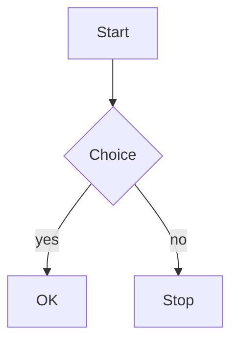

> English: [README.md](./README.md)

# @ampless/plugin-mermaid

[ampless](https://github.com/heavymoons/ampless) 向け Mermaid ダイアグラムプラグイン。`mermaid` 言語を指定したコードブロックを、CDN から遅延ロードした [mermaid.js](https://mermaid.js.org/) で公開サイト上の図として描画します。

> **プレリリース / ベータ版。** v1.0 まではマイナーバージョンでも破壊的変更が入る可能性があります。

`publicHead` capability 経由でインラインスクリプトを 1 本だけ `<head>` に注入します。公開ページ側でスクリプトが `<pre><code class="language-mermaid">` ブロックを走査し、**1 つでも存在する場合のみ** jsDelivr から mermaid.js を動的 import して各ブロックを SVG ダイアグラムに描画します。Mermaid ブロックの無いページではライブラリを一切ダウンロードしません。

AWS のデータ権限は不要です。ディスクリプタの生成は公開 Next.js プロセスのリクエスト時に行われ、描画はブラウザ上で行われます。`trust_level` は `untrusted`。

## インストール

```bash
pnpm add @ampless/plugin-mermaid@beta
```

## 設定

`cms.config.ts` に記述します:

```ts
import { defineConfig } from 'ampless'
import mermaidPlugin from '@ampless/plugin-mermaid'

export default defineConfig({
  // ...
  plugins: [mermaidPlugin()],
})
```

## オプション

```ts
mermaidPlugin({
  version: '11.15.0', // 既定値（固定 x.y.z）
  theme: 'auto', // auto | default | dark | forest | neutral | base
  securityLevel: 'strict', // strict | loose | antiscript | sandbox
})
```

| オプション      | デフォルト  | 備考                                                                                                                                                                                                          |
| --------------- | ----------- | ------------------------------------------------------------------------------------------------------------------------------------------------------------------------------------------------------------- |
| `version`       | `'11.15.0'` | jsDelivr から読み込む mermaid のバージョン。`x` / `x.y` / `x.y.z` に一致する必要あり。不正値は `console.warn` してデフォルトにフォールバック。                                                                |
| `theme`         | `'auto'`    | `auto` / `default` / `dark` / `forest` / `neutral` / `base` のいずれか。`'auto'`（既定）はサイトのカラースキームに追従します（[カラースキーム](#カラースキーム)参照）。それ以外は `'auto'` にフォールバック。 |
| `securityLevel` | `'strict'`  | `strict` / `loose` / `antiscript` / `sandbox` のいずれか。それ以外は `strict` にフォールバック。[セキュリティ](#セキュリティ--cdn-に関する注意)参照。                                                         |

## カラースキーム

既定の `theme: 'auto'` では、図のテーマがサイトのライト/ダークのカラースキームに追従するため、ダーク背景でも図のテキストが読みやすく保たれます（mermaid はテーマ色を描画後 SVG に焼き込むため、ダークページに明テーマだと低コントラストになります）:

| サイトのスキーム | 使用する mermaid テーマ |
| ---------------- | ----------------------- |
| light            | `default`               |
| dark             | `dark`                  |

スキームは実行時に次の順で判定します:

1. `<html data-color-scheme>` 属性 — サイトがスキームを固定する場合（サイト内トグル含む）に ampless が `'light'` / `'dark'` を設定します。
2. 属性が無い場合（サイト設定 `auto`）は OS の `prefers-color-scheme` を使用します（ガード付き。`matchMedia` 未定義環境では light 扱い）。

**ライブ切替。** スキームが変わると図はその場で再描画されます — サイト内トグルが `data-color-scheme` を切り替えたとき、および（`auto` モードで属性がスキームを固定していないとき）OS の設定が変わったときの両方に追従します。mermaid は既存 SVG を再着色できないため、描画済みの各図は元ソースを `data-mermaid-src` 属性に保持しておき、そこから再描画します。図の無いページではスキーム変更時もライブラリをダウンロードしません。

**固定。** 明示テーマ（例: `theme: 'dark'`）を渡すと、サイトのスキームに関わらずそのテーマに固定され、ライブ再描画も無効になります。従来の既定 `'default'` でのライトページ出力は不変です。

## コードブロックの検出方法

描画後の投稿 HTML から `<pre><code class="language-mermaid">` を探します。ampless のツールバーにあるコードブロック単位の **言語エディタ**が `language-*` クラスを付与し、どの本文フォーマットでも同じ形に着地します:

| `post.format` | クラスの付き方                                                                 |
| ------------- | ------------------------------------------------------------------------------ |
| `tiptap`      | コードブロックノードの `language` 属性 → 描画時に `class="language-mermaid"`。 |
| `markdown`    | フェンスドブロック ` ```mermaid ` → `class="language-mermaid"`。               |
| `html`        | 記述された `<pre><code class="language-mermaid">` はそのまま保持。             |

`mermaid` コードブロックの中に図のソースを書きます:

````markdown

````

描画後はプラグインが `<pre>` 全体を `<div class="ampless-mermaid">…svg…</div>` に置換するため、テーマ CSS から `.ampless-mermaid` を対象にスタイリングできます。

## @ampless/plugin-highlight との共存

両プラグインは順序非依存で同時に動作するよう設計されています。`@ampless/plugin-highlight` は `code.language-mermaid` を明示的に除外し、本プラグインは `<pre>` ごと置換するため、Mermaid ブロックがシンタックスハイライトされることも、ハイライト済みブロックが図として扱われることもありません。

## クライアント側の堅牢性

- **冪等な再スキャン** — 処理済みブロックは `data-ampless-done` でマークするため、二重描画しません。
- **SPA / App Router 遷移** — head スクリプトは一度だけ実行されますが、`document.body` に張ったデバウンス付き `MutationObserver` が、クライアント遷移で後から挿入された投稿コンテンツを再スキャンします。
- **ライブなスキーム切替** — `<html>`（`data-color-scheme`）への `MutationObserver` と、`auto` モード時の `matchMedia('(prefers-color-scheme: dark)')` リスナが、スキーム変更時に図を再描画します。短時間に連続して切り替えても最終スキームへ収束します（古いスキームに対して解決した描画結果は破棄して再キックします）。
- **失敗時の復旧** — 動的 import が失敗した場合はキャッシュした import Promise を破棄し、ブロックのマークも外すため次回スキャンで再試行されます。失敗は握り潰さず `console.warn` で報告します。個別の図の描画失敗時は元のコードブロックを残します（再描画の失敗時は直前の SVG を残し、次回のスキーム変更で再試行します）。

## セキュリティ / CDN に関する注意

- 図のソースは（半信頼の）投稿本文由来なので **既定は `securityLevel: 'strict'`** です。`'loose'` にするとインタラクティブ機能（クリックハンドラ、リンク）が有効になりますが、図に書かれた `javascript:` href による XSS も成立します。本文を編集できる全員を完全に信頼できる場合のみ `'loose'` を使ってください。
- **既定バージョンは固定。** 供給網の攻撃面を最小化するため `version` の既定値は厳密な `x.y.z` です。floating な major/minor タグ（例: `'11'`）も指定できますが、その供給網リスクは利用者の責任です。
- **動的 `import()` には SRI（Subresource Integrity）が効きません。** ライブラリは実行時に jsDelivr から取得され、integrity 固定はできません。ライブラリの自前ホスティングは将来のオプションとして検討します。

## v1 で対応しないこと

- mermaid 自身の `securityLevel` を超える **SVG の後処理 / DOMPurify 通し**は行いません。描画後 SVG の強化は将来の拡張候補です。
- **ビルド時 / サーバサイドレンダリングは非対応** — 図はブラウザで描画されるため、JS 無効クライアントや初回描画時には図のソースがそのまま見えます。
