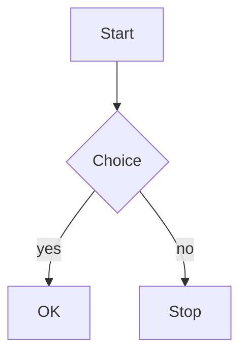

> 日本語版: [README.ja.md](./README.ja.md)

# @ampless/plugin-mermaid

Mermaid diagram plugin for [ampless](https://github.com/heavymoons/ampless). Renders fenced code blocks tagged with the `mermaid` language as diagrams on the public site, using [mermaid.js](https://mermaid.js.org/) loaded lazily from a CDN.

> **Pre-release / beta.** Breaking changes possible in any minor version until v1.0.

The plugin injects a single inline script into `<head>` via the `publicHead` capability. On the public page the script scans for `<pre><code class="language-mermaid">` blocks and, **only if at least one exists**, dynamically imports mermaid.js from jsDelivr and renders each block to an SVG diagram. Pages without a Mermaid block never download the library.

No AWS data permissions are required — the descriptor is produced at request time in the public Next.js process and the rendering happens in the browser. The plugin's `trust_level` is `untrusted`.

## Install

```bash
pnpm add @ampless/plugin-mermaid@beta
```

## Configure

In `cms.config.ts`:

```ts
import { defineConfig } from 'ampless'
import mermaidPlugin from '@ampless/plugin-mermaid'

export default defineConfig({
  // ...
  plugins: [mermaidPlugin()],
})
```

## Options

```ts
mermaidPlugin({
  version: '11.15.0', // pinned default
  theme: 'default', // default | dark | forest | neutral | base
  securityLevel: 'strict', // strict | loose | antiscript | sandbox
})
```

| Option          | Default     | Notes                                                                                                                                  |
| --------------- | ----------- | -------------------------------------------------------------------------------------------------------------------------------------- |
| `version`       | `'11.15.0'` | mermaid version loaded from jsDelivr. Must match `x` / `x.y` / `x.y.z`. Invalid values fall back to the default with a `console.warn`. |
| `theme`         | `'default'` | One of `default` / `dark` / `forest` / `neutral` / `base`. Anything else falls back to `default`.                                      |
| `securityLevel` | `'strict'`  | One of `strict` / `loose` / `antiscript` / `sandbox`. Anything else falls back to `strict`. See [Security](#security--cdn-notes).      |

## How code blocks are detected

The plugin looks for `<pre><code class="language-mermaid">` in the rendered post HTML. The ampless toolbar's per-code-block **language editor** writes the `language-*` class, and all body formats land on the same shape:

| `post.format` | How the class appears                                                                      |
| ------------- | ------------------------------------------------------------------------------------------ |
| `tiptap`      | The code-block node carries a `language` attribute → `class="language-mermaid"` on render. |
| `markdown`    | A fenced block ` ```mermaid ` → `class="language-mermaid"`.                                |
| `html`        | Authored `<pre><code class="language-mermaid">` is preserved literally.                    |

Write your diagram source inside a `mermaid` code block:

````markdown

````

The plugin replaces the whole `<pre>` with `<div class="ampless-mermaid">…svg…</div>` once rendered, so you can target `.ampless-mermaid` from your theme CSS.

## Coexistence with @ampless/plugin-highlight

The two plugins are designed to run together in any order. `@ampless/plugin-highlight` explicitly skips `code.language-mermaid`, and this plugin replaces the `<pre>` outright, so a Mermaid block is never syntax-highlighted and a highlighted block is never treated as a diagram.

## Client-side robustness

- **Idempotent re-scan** — processed blocks are marked with `data-ampless-done`, so the scan never double-renders.
- **SPA / App Router navigation** — the head script runs once, but a debounced `MutationObserver` on `document.body` re-scans when client navigation injects new post content.
- **Failure recovery** — if the dynamic import fails, the cached import promise is cleared and the block marks are removed so a later scan retries; failures are reported via `console.warn` rather than swallowed. A per-diagram render failure leaves the original code block visible.

## Security / CDN notes

- **`securityLevel: 'strict'` is the default** because the diagram source comes from the (semi-trusted) post body. Switching to `'loose'` enables interactive features (click handlers, links) but also allows `javascript:` href XSS authored into a diagram. Only use `'loose'` if you fully trust everyone who can edit post bodies.
- **Pinned default version.** The default `version` is an exact `x.y.z` to minimize supply-chain surface. You may pass a floating major/minor tag (e.g. `'11'`), but the supply-chain risk of a floating tag is your responsibility.
- **Dynamic `import()` cannot use Subresource Integrity (SRI).** The library is fetched from jsDelivr at runtime; there is no integrity pin. Self-hosting the library is a possible future option.

## What it does not do (v1)

- **No SVG post-processing / DOMPurify pass** beyond mermaid's own `securityLevel`. Hardening the rendered SVG is a possible future enhancement.
- **No build-time / server-side rendering** — diagrams render in the browser, so a no-JS client or the first paint shows the raw diagram source.
